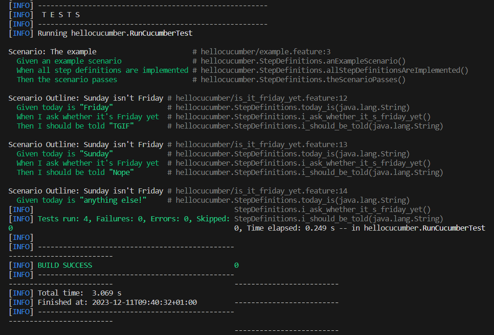
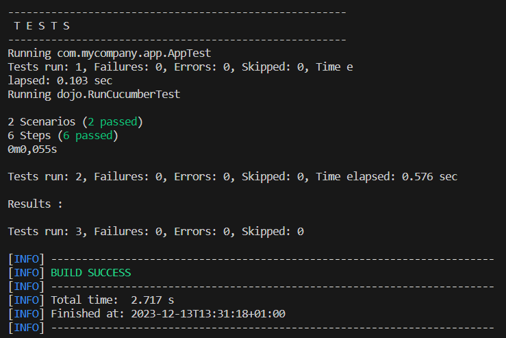
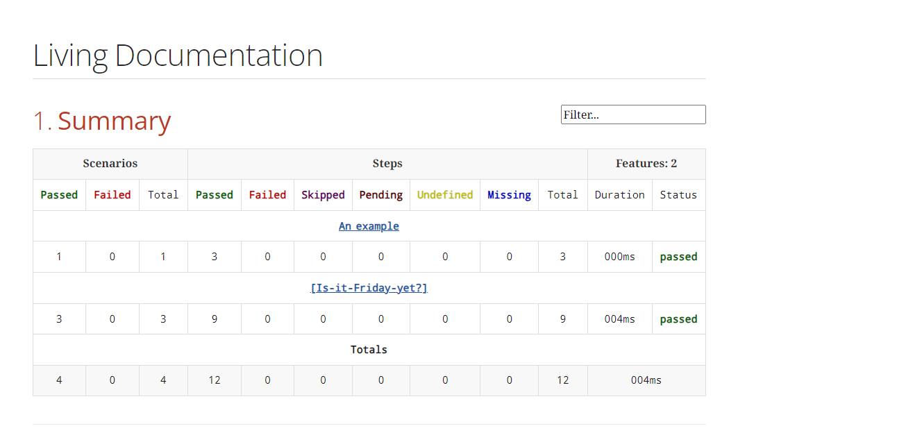

image::https://classroom.github.com/assets/open-in-vscode-718a45dd9cf7e7f842a935f5ebbe5719a5e09af4491e668f4dbf3b35d5cca122.svg[Open in Visual Studio Code]
link:https://classroom.github.com/online_ide?assignment_repo_id=13206692&assignment_repo_type=AssignmentRepo[Open in Visual Studio Code]

= R5.A.08 -- Dépôt pour les TPs
:icons: font
:MoSCoW: https://fr.wikipedia.org/wiki/M%C3%A9thode_MoSCoW[MoSCoW]

Ce dépôt concerne les rendus de mailto:mickael.fernandez@etu.univ-tlse2.fr[Mickael Fernandez].

== TP1

.Exemple de code
[source,java]
---
@Given("today is Sunday")
public void today_is_sunday() {
    // Write code here that turns the phrase above into concrete actions
    throw new io.cucumber.java.PendingException();
}
---

.Exemple d'image insérée en asciidoc
image::artifacts-r303.svg[width=80%]

.La feature ``is_it_friday_yet.feature`` :
[source, gherkin]
---
# language: en
Feature: Is it Friday yet?
  Everybody wants to know when it's Friday
  Scenario Outline: Sunday isn't Friday
    Given today is "<day>"
    When I ask whether it's Friday yet
    Then I should be told "<answer>"
  Examples:
    | day            | answer |
    | Friday         | TGIF   |
    | Sunday         | Nope   |
    | anything else! | Nope   |
---

.Capture d'écran des tests

== TP2

.Le code de la classe ``Order.java`` : 
[source, java]
package dojo;
import java.util.ArrayList;
import java.util.List;
---
public class Order {
    private String owner;
    private String target;
    private List<String> cocktails;
    ---
    public Order() {
        this.owner = null;
        this.target = null;
        this.cocktails = new ArrayList<>();
    }
    public void declareOwner(String owner) {
        this.owner = owner;
    }
    public void declareTarget(String target) {
        this.target = target;
    }
    public String getOwner() {
        return this.owner;
    }
    public String getTarget() {
        return this.target;
    }
    public List<String> getCocktails() {
        return this.cocktails;
    }
    public void addCocktail(int nbCocktails) {
        for(int i = 0; i < nbCocktails; i++) {
            this.cocktails.add("cocktail");
        }
    }
}
---

.Capture d'écran des tests du TP2

== TP4

Seule la documentation Cukedoctor sera fournie (car Serenity ne semble pas avoir les permissions requises) :

http://127.0.0.1:5500/hellocucumber/target/cukedoctor/documentation.html

Ou alors vous avez un extrait ici-même du rendu avec ``hellocucumber`` :

